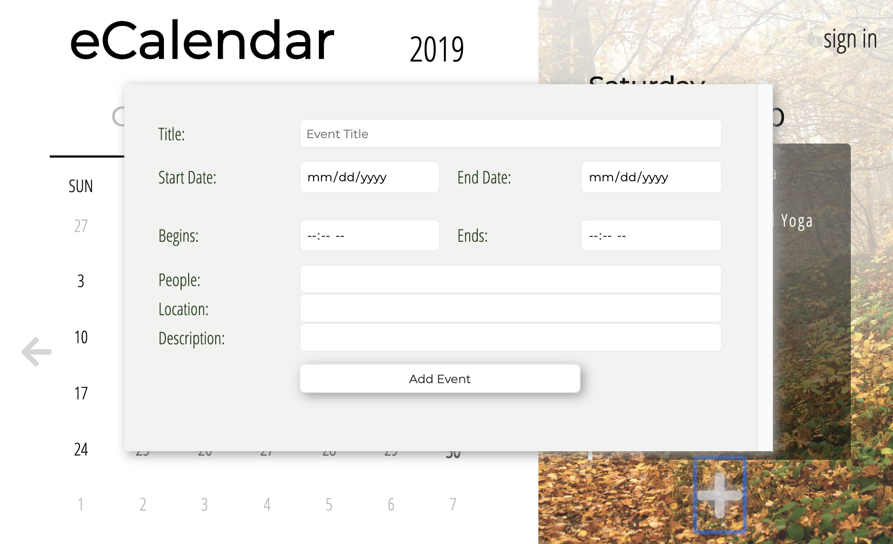
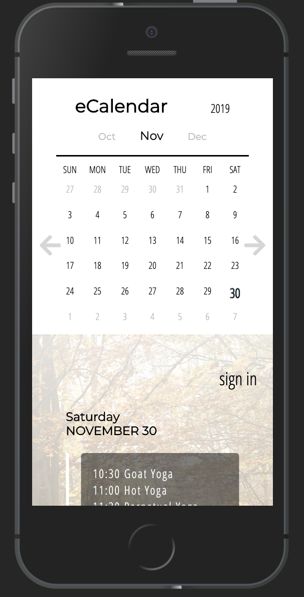
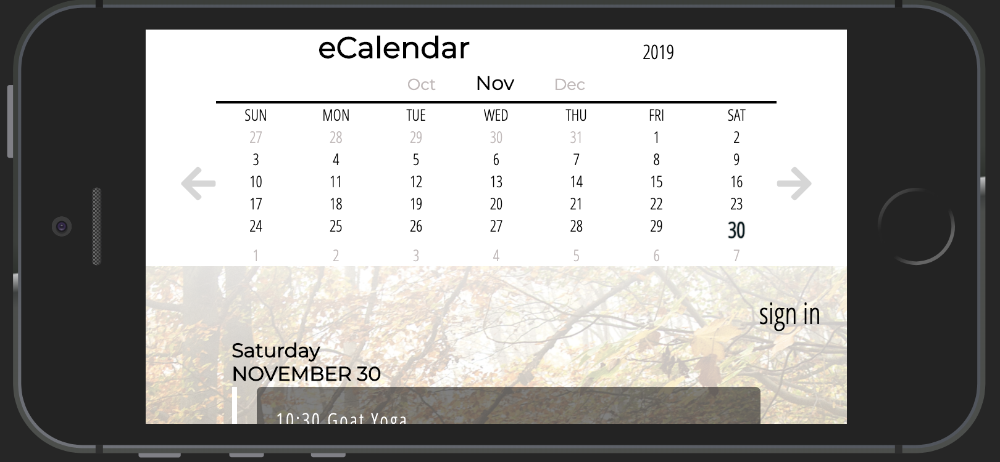
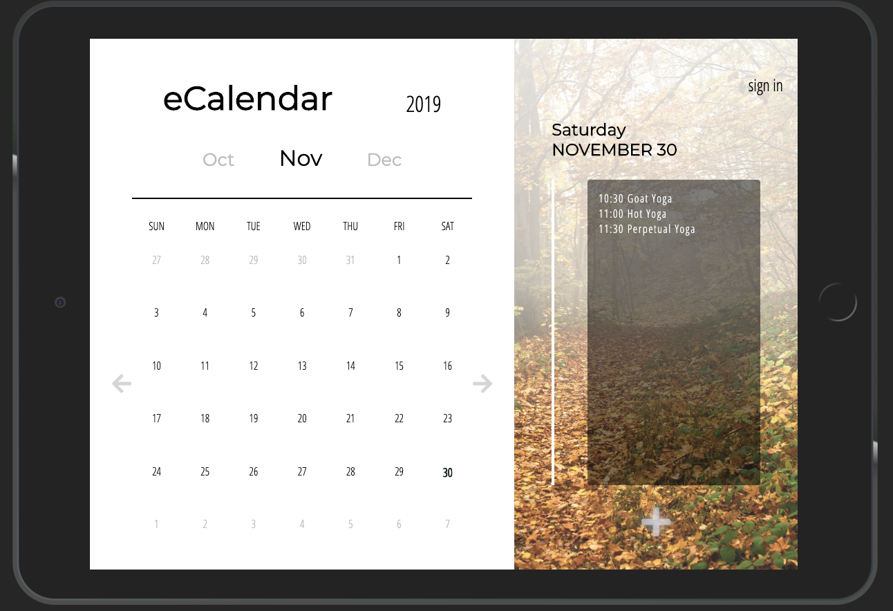

# Chingu Voyage Pre-Work Solo Project (Tier 2): *eCalendar*

 

## Overview 

This project is a great opportunity to develop a clean and modern webpage. The *eCalendar* app will be completed across tiers, with each tier adding a new level of complexity. You are currently on the **Tier 2 repo**. You'll be responsible for coding the **HTML**, **CSS**, and **JavaScript** to get the structure, styling, and some basic functionality up and running.

As you add skills to your developer toolbag you'll be able to come back to this project and add in the Tier 3 features. Ultimately you'll have a great portfolio piece, and will have implemented a number of common and in-demand features.

**You May Use Libraries and/or Frameworks for Tiers 2 and 3**

## Instructions

General instructions for all Pre-Work Projects can also be found in the Chingu Voyage Handbook (URL posted in the `#read-me-first` channel on Discord).

#### Requirements

*Structure*

- [ ] Page divided into calendar potion and event list portion

- [ ] Calendar portion to have:  

  - [ ] Title and Current year in header  
  - [ ] Current month between previous and upcoming month 
  - [ ] Calendar dates of the month with display of previous month’s last dates if first day of current month does not start on a Sunday 
  - [ ] Arrows bordering the body of the calendar 

- [ ] Event portion to have

  - [ ]  Current day of the week displayed  
  - [ ]  Current month and date (numerical) displayed  
  - [ ]  List of Events with corresponding date of month divided by a vertical bar  
  - [ ]  Add event button at bottom 

- [ ] *At least* **3** demo events in the event panel portion of the project 

- [ ] A modal form activated via button click that floats above the content

*Styling:*

- [ ] Styles should be reminiscent of the demo versions. Feel free to use artistic licencse as long as the functionality doesn't suffer 

*Functionality*

*Upon Load:*

- [ ] Calendar will display correct layout of the current month with the weeks starting on Sunday
- [ ] Displays last days of previous month and/or first days of next month as buffers when needed; set apart with styling
- [ ] Set the current date apart from the others (in the demo above it is bolded)

*Scrolling:*

- [ ] Your calendar must scroll backwards and forwards accurately

*Modal Form:*
- [ ] This form is used to add new events to to the calendar. It is displayed when the user clicks the add icon in appointment panel
- [ ] Be able to close form without submission and have form close on submission of event information
- [ ] Have modal displayed as shown in images below
- [ ] Have at least the event name and dates as required, the other fields shown are optional
- [ ] Is hidden when not in use

*Other:*

- [ ] Your repo needs to have a robust README.md
- [ ] Make sure that there are no errors in the developer console before submitting

**Extras (Not Required)**

- [ ] Make your design fully responsive *(small/large/portrait/landscape, etc.)*
- [ ] Optimized loading of calendar site (hint, consider the background image)
- [ ] Change the background image based on the season in which the current displayed month is part of

## Example

*The static images below show the modal form as well as different responsive design implementations*

 

 

 